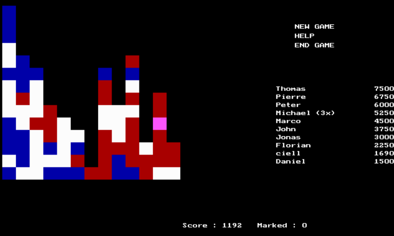

# SameGame in C++

### Team member

Zhiheng LYU (3035772432)

Xijia TAO (3035767762)

### Game description

- The basic interface is shown below (just a bit similar to it in a way):

- Initially, the field is filled with blocks of different colors.
- As the game we familiar with, we can eliminate two or more adjacent blocks of the same color. The more blocks you eliminate at one time, the higher your score will be. 
- After every removal, blocks that are not supported will fall down. If a column has no blocks, other columns on its right will slide towards it (i.e., to the left).
- There is a bonus point for leaving as few blocks as possible that can not be eliminated.
- If your score exceeds the requirements for the current round, you can continue the game and proceed to the next round.

### Game features

1. Generation of random game sets or events
   
   - We use seed to generate a random game graph based on a difficulty factor that increases with the number of rounds of the game. The difficulty factor is primarily determined by the expected score when interacting with the game randomly, i.e., by applying Monte Carlo method.
   
2. Data structures for storing game status
   
   - We generate a random game *graph* based on a difficulty factor that increases with the number of rounds of the game.
   
3. Dynamic memory management

   - We use linked lists to store map information, and we delete parts of the map that have been eliminated in time. Linked lists, in comparison to arrays, can have dynamic sizes and cost less time of deletion.

   - After finishing a round of the game, we delete and recreate a `Map` object to prevent memory leaks.

4. File input/output (e.g., for loading/saving game status)
   - We generate a `name.json` (The `name` is from input) to store, including the current map information, the score information, and the number of rounds played.
   - The information about the leaderboards is stored in the `rank.json` file

5. Program codes in multiple files
   - `./lib` includes the library files required by the code
   - `./bin` includes the binary executables
   - `./src` includes the source files:
     - `main.cpp`
       - `save_and_load.cpp`
         - `save_and_load.h`
       - `map.cpp`
         - `map.h`
       - `visualization.cpp`
         - `visualization.h`

### External libraries that might be used

- `ncurses`
