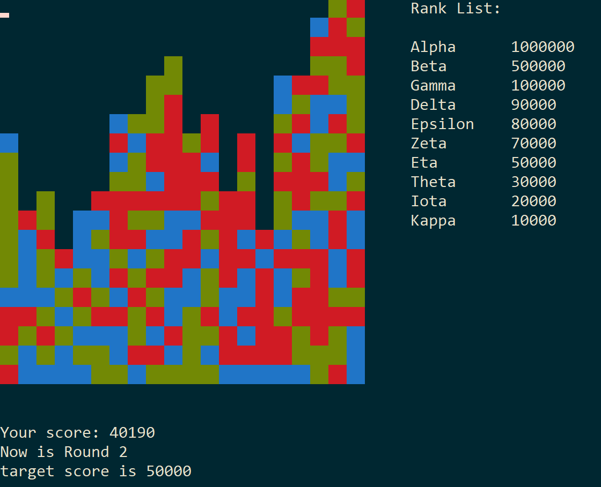

# SameGame in C++

### Team Members

Zhiheng LYU (3035772432)

Xijia TAO (3035767762)

### Game Description

- Initially, the field is filled with blocks of different colors.
- One can eliminate two or more adjacent blocks of the same color. The more blocks one eliminate at a time, the higher the score s/he will get for that operation. 
- After every operation, blocks that are no longer supported will fall down. If a column has no blocks, other columns on its right will slide towards it (i.e., to the left).
- If one's score exceeds the requirements for the current round, s/he can continue the game and proceed to the next round.

### Game Features

1. Generation of random game sets or events
   
   - We use seed to randomly generate a game board and a leaderboard (*TODO*).
2. Data structures for storing game status
   
   - We create a class `map` for keeping track of the game board as well as conducting operations upon it. Note that the board is stored simply as a 2D array due to its fixed size.
   - For storing and loading game status, we choose to create a separate class named `current_map`, which contains information on the board and number of rounds and helper functions to store/load them accordingly. 
   - We also design a structure and a class to implement a rank list for our game's leaderboard.
3. Dynamic memory management 
   - We use the `new` operator to allocate memory for the class objects and then call their object constructors. Pointers are used to store these memory addresses. Hence, when the game is over, we can use the `delete` operator to deallocate the memory allocated with the `new` operator.
4. File input/output (e.g., for loading/saving game status)

   - Before/during the game, one has the option to load a stored game board and continue to play.

   - During the game, one has the option to save the current map information, the score information, and the number of rounds played to `log/[filename].txt`, with the filename determined by his/her input.
   - When the game is over, one has the option to save his/her score to the leaderboard in `log/rank.txt`, with the displayed name given from input. The updated leaderboard will be displayed next time s/he play the game.
5. Program codes in multiple files
   - `./lib` includes the non-standard library files required by the code
   - `./bin` includes the binary executables
   - `./src` includes the source files:
     - `main.cpp`
       - `map.cpp`
         - `map.h`
       - `visualization.cpp`
         - `visualization.h`
       - `saveAndLoad.cpp`
         - `saveAndLoad.h`

### External Libraries 

- `ncurses` is used to visualize the text-based game as well as processing inputs from both keyboard and mouse.

### Further Info

[**Compilation & Execution Instructions**](doc/get_started.md)

[**In-Game Instructions**](doc/Instructions.md)

[**Video Demonstration**](https://drive.google.com/file/d/1vaTy-hpKP5s_BxZUd_zZaw05tJUoflZG/view?usp=sharing)